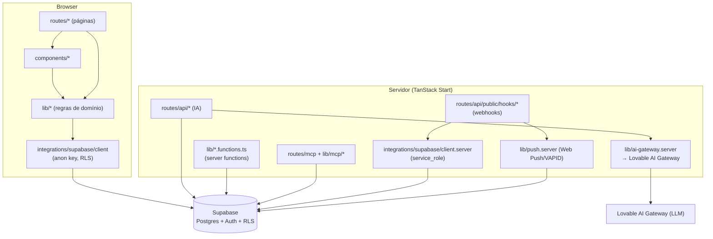
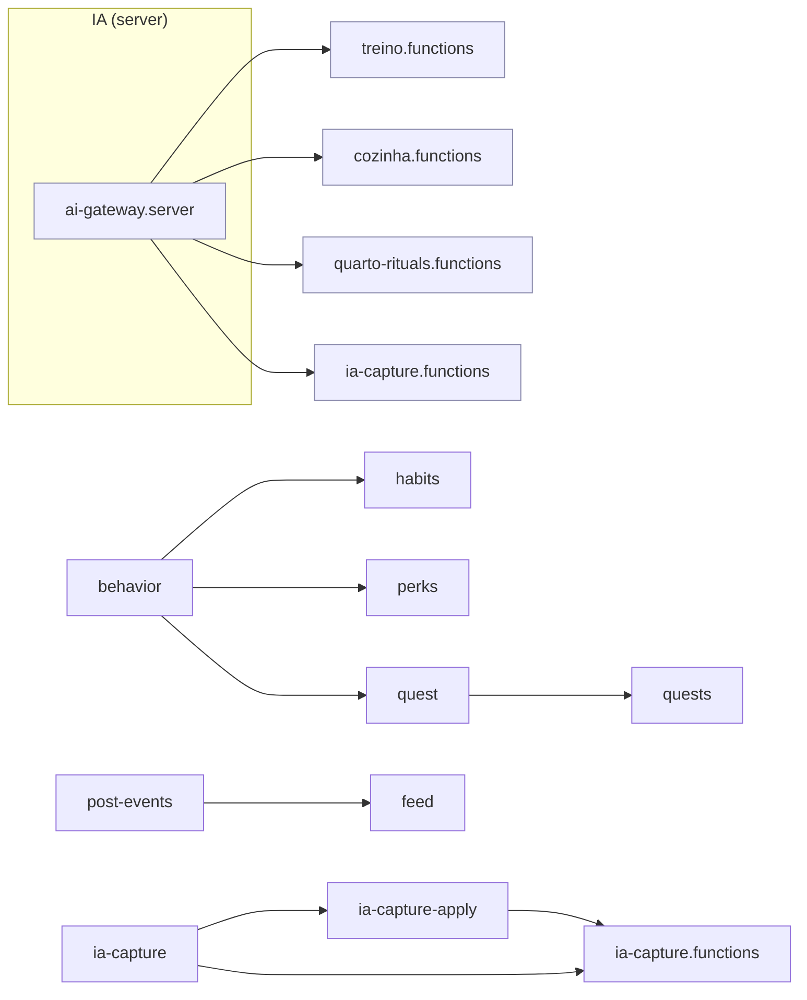
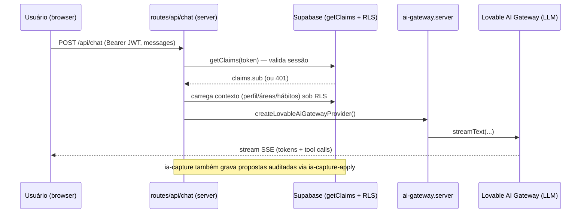
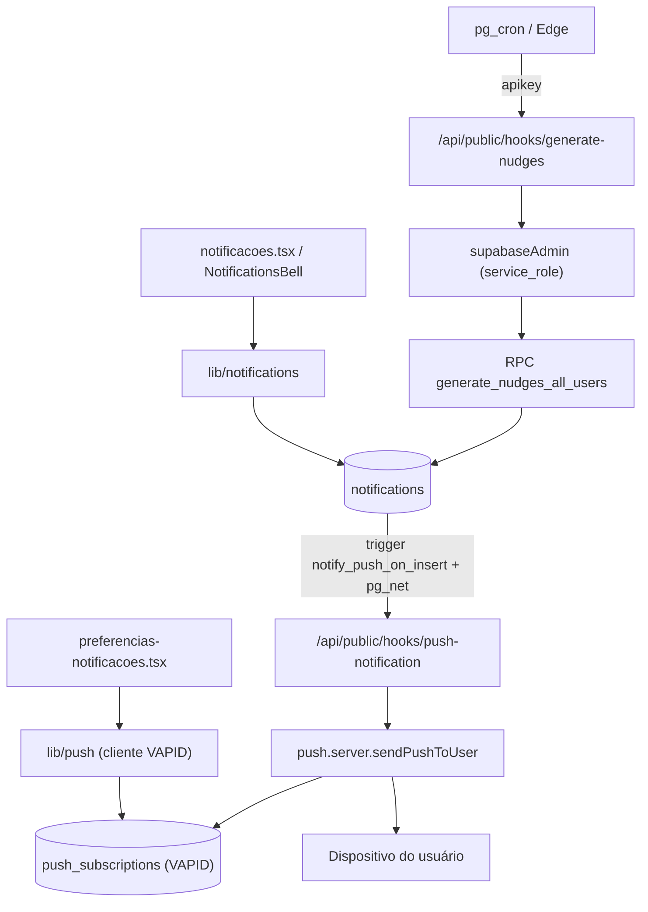
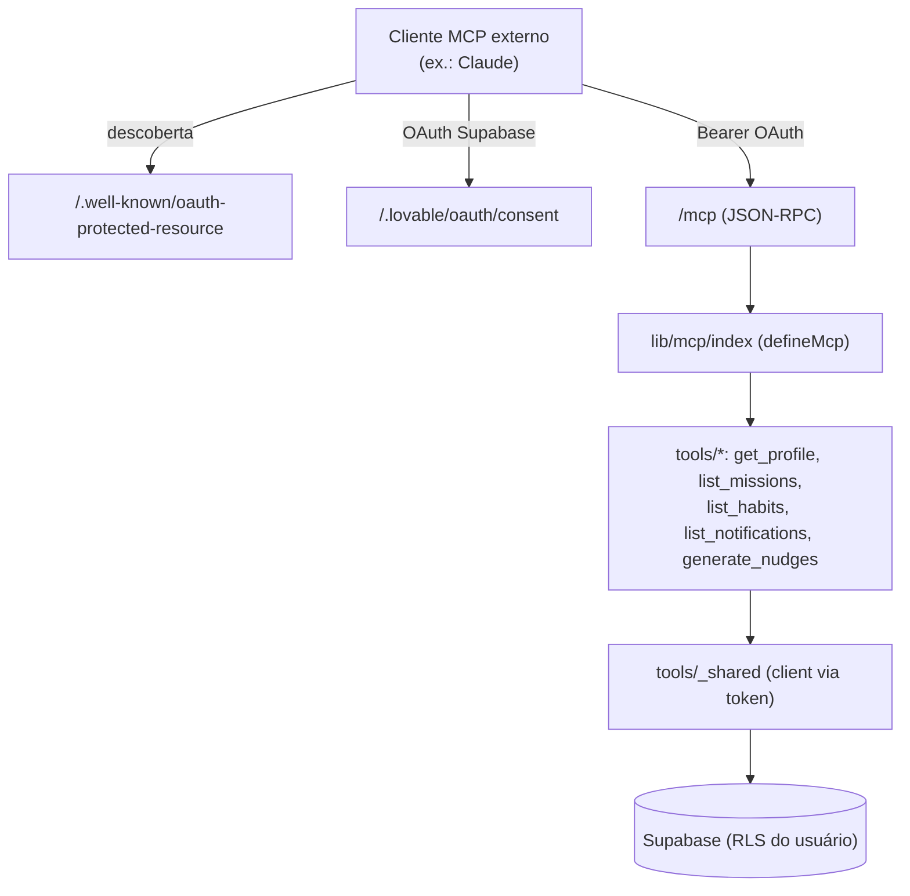

# Arquitetura — Vertical Vision

Guia detalhado da arquitetura: o que cada arquivo faz, quem conversa com quem, quem depende
de quem, e o catálogo completo das rotas com diagrama. Complementa o [`README.md`](./README.md)
(visão geral) e o [`openapi.json`](./openapi.json) (contrato das rotas).

> Diagramas em Mermaid — renderizam no GitHub e em qualquer viewer compatível.

---

## 1. Camadas e princípio geral

O app tem **duas faces** que compartilham o mesmo código:

- **Cliente (browser)** — páginas e componentes React que falam com o Supabase pelo client
  do navegador (`@/integrations/supabase/client`, chave anon, sujeito a **RLS**).
- **Servidor (TanStack Start)** — endpoints `api/*`, *server functions* (`*.functions.ts`) e o
  servidor MCP, que rodam no backend e falam com o Supabase e o Lovable AI Gateway.

**Regra de ouro de acesso a dados:**

- `integrations/supabase/client.ts` → cliente **browser** (anon key). Todo acesso passa por
  **RLS** — é a segurança dos dados do usuário no front.
- `integrations/supabase/client.server.ts` (`supabaseAdmin`) → **service_role**, ignora RLS.
  Só é usado nos **webhooks** (`generate-nudges`, `push-notification`).
- Endpoints de IA (`api/chat|ia-capture|sleep-chat|wake-chat`) criam um cliente Supabase
  **a partir do JWT do usuário** (via `@supabase/supabase-js`), então continuam sob RLS.
- *Server functions* (`*.functions.ts`) usam `auth-middleware` (`requireSupabaseAuth`) para
  exigir sessão antes de rodar no servidor.

---

## 2. Catálogo de arquivos (o que cada um faz)

### 2.1 `src/integrations/` — pontes externas (auto-geradas)

| Arquivo | Papel |
|---|---|
| `supabase/client.ts` | Cliente Supabase do **browser** (anon key). Exporta `supabase`. Usado por páginas/componentes/libs de leitura-escrita sob RLS. |
| `supabase/client.server.ts` | Cliente **admin** (`supabaseAdmin`, service_role). Ignora RLS — só nos webhooks. |
| `supabase/auth-middleware.ts` | `requireSupabaseAuth` — guarda de sessão para *server functions*. |
| `supabase/auth-attacher.ts` | `attachSupabaseAuth` — injeta o contexto de auth no request server-side. |
| `supabase/types.ts` | Tipos gerados do schema (`Database`, `Tables`, `Enums`...). Fonte de tipagem de todo o domínio. |
| `lovable/index.ts` | Integração Lovable (`lovable`) — telemetria/erros do editor. |

### 2.2 `src/lib/` — regras de domínio

Agrupadas por área. Cada módulo concentra a lógica de negócio e fala com o Supabase.

**Gamificação e progresso**

| Arquivo | O que faz |
|---|---|
| `behavior.ts` | Classificação comportamental: calcula a **classe** do jogador a partir de eixos/perguntas (`BEHAVIOR_QUESTIONS`, `computeScores`). Base de `habits`, `perks`, `quest`. |
| `level-tracks.ts` | Trilhas de nível e rank a partir de XP (`LEVEL_TRACKS`, `rankFromXP`). |
| `perks.ts` | Perks/títulos por classe e nível; desbloqueios (`checkPerkUnlocks`, `playerLevel`). |
| `achievements.ts` | Conquistas e capítulos de lore (`listAchievements`, `listUserAchievements`). |
| `crystals.ts` | Cristais (moeda/power-ups): catálogo, ativos, raridade. |
| `score.ts` | Score pessoal semanal (ISO), breakdown, histórico e snapshot. |
| `habits.ts` | Hábitos: CRUD, toggle diário, seed por classe, progresso mensal. Depende de `behavior`. |
| `missions.ts` | Missões do usuário: agenda do dia, toggle, CRUD. |
| `area-missions.ts` | Missões por **área da vida** e progresso agregado. |
| `quest.ts` / `quests.ts` | Quest do dia: `buildDailyQuest` (regra pura, usa `behavior`) e persistência (`ensureTodayQuest`, `completeQuest`). |

**Áreas da vida**

| Arquivo | O que faz |
|---|---|
| `area-extra.ts` | Estado extra por área: intenção da Casa, entrada mental do dia, inclusão. |
| `treino.functions.ts` | *Server function*: gera/parseia plano de treino via IA (auth-middleware + ai-gateway). |
| `cozinha.functions.ts` | *Server function*: plano de dieta via IA. |
| `quarto-rituals.functions.ts` | *Server function*: sugere rituais do quarto via IA. |
| `wake.functions.ts` | *Server function*: alarmes, sessão de despertar, snooze, sonhos, "markAwake". |
| `mental.ts` | Área mental: histórico, crenças e confrontos (`belief_confrontations`). |
| `ritual.ts` | Rituais e preferências de notificação por ritual. |

**IA (assistentes)**

| Arquivo | O que faz |
|---|---|
| `ai-gateway.server.ts` | `createLovableAiGatewayProvider` — provider do **Lovable AI Gateway** (LLM). Núcleo de toda geração de IA. |
| `ia-capture.ts` | Tipos + whitelist da IA-Coletora (`ALLOWED_ACTIONS`, `ACTION_TO_TABLE`, campos editáveis do perfil). |
| `ia-capture-apply.ts` | Lógica compartilhada de aplicação das escritas auditadas propostas pela IA. |
| `ia-capture.functions.ts` | *Server function*: aplica/rejeita/desfaz escritas de auditoria. |

**Social e moderação**

| Arquivo | O que faz |
|---|---|
| `social.ts` | Amizades, grupos, desafios com progresso, perfis de amigos. |
| `feed.ts` | Feed: posts, upload de mídia, URLs assinadas, visibilidade. Usa `post-events`. |
| `post-events.ts` | Eventos anexados a posts + RSVP. |
| `group-chat.ts` | Chat de grupo (listar, enviar, apagar, realtime). |
| `moderation.ts` | Report, bloquear/desbloquear, conjunto de bloqueados. |

**Orientador ↔ aluno**

| Arquivo | O que faz |
|---|---|
| `orientador.ts` | Vínculo orientador-aluno, snapshot do aluno, códigos/convites. |
| `orientador-chat.ts` | Mensagens (threads) entre orientador e aluno + realtime. |

**Notificações e push**

| Arquivo | O que faz |
|---|---|
| `notifications.ts` | Notificações in-app: listar, contar não-lidas, marcar lidas, `generateMyNudges`. |
| `push.ts` | Web Push no **cliente** (VAPID): permissão, inscrever/desinscrever. |
| `push.server.ts` | Envio de push **no servidor** (`sendPushToUser`), respeitando prefs por categoria. |
| `push.functions.ts` | *Server function*: `sendTestPush`. |

**Pagamentos, planejamento, wearables, loja**

| Arquivo | O que faz |
|---|---|
| `stripe.ts` / `stripe.server.ts` | Stripe no cliente (`getStripe`) e no servidor (client + tratamento de erro), via connector-gateway Lovable. |
| `planning.ts` | Metas estratégicas, quests agendadas, calendário (trimestres). |
| `wearables.ts` | Amostras e conexões de wearables; parse/import de arquivos. |
| `shop.ts` | Loja: itens, inventário, brasas, compra. |
| `studio.ts` | Studio: recompensas e desafios administráveis (`checkStudioAdmin`). |

**Infra e utilidades**

| Arquivo | O que faz |
|---|---|
| `theme.ts` | Temas + script inline anti-FOUC (`THEME_BOOT_SCRIPT`). |
| `pwa.ts` | Registro guardado do service worker (nunca em dev/iframe). |
| `smooth-scroll.ts` | Scroll suave por setas. |
| `countries.ts` | Lista de países + `formatE164` (login por telefone). |
| `phone-login.functions.ts` | *Server function*: login por telefone (resposta genérica, não vaza existência). |
| `mentor-tips.ts` | Conteúdo do Mentor: explica cada rota e propõe perguntas. |
| `error-capture.ts` / `error-page.ts` / `lovable-error-reporting.ts` | Captura de erro out-of-band, render de página de erro, report ao Lovable. |
| `utils.ts` | `cn` (merge de classes Tailwind). |

### 2.3 `src/lib/mcp/` — servidor MCP `personal-ia-mcp`

| Arquivo | O que faz |
|---|---|
| `index.ts` | Define o servidor MCP (`defineMcp`) com **auth OAuth** (issuer Supabase, audience `authenticated`) e registra as 5 tools. |
| `tools/_shared.ts` | Helper compartilhado: cria cliente Supabase a partir do token OAuth (sob RLS). |
| `tools/get-profile.ts` | Tool `get_profile` — perfil do usuário (read-only). |
| `tools/list-missions.ts` | Tool `list_missions` — missões ativas (read-only). |
| `tools/list-habits.ts` | Tool `list_habits` — hábitos ativos (read-only). |
| `tools/list-notifications.ts` | Tool `list_notifications` — notificações (read-only). |
| `tools/generate-nudges.ts` | Tool `generate_nudges` — roda o motor de nudges (escrita, idempotente). |

### 2.4 `src/components/` — UI (por pasta)

| Pasta | Nº | Papel |
|---|--:|---|
| `ui/` | 46 | Design system (shadcn/Radix): button, dialog, card, form, table, etc. |
| `area/` | 9 | Cards de cada área (Treino, Cozinha, Quarto, Casa, Mental, Inclusão) + header/linha de missão. |
| `social/` | 6 | Feed, PostCard, PostComposer, GroupChat, FriendCode, BlockedList. |
| `map/` | 5 | Mapa gamificado: BentoArea, HUD, CheckinSheet, QuestOfDayCard, XPToast. |
| `onboarding/` (+`inputs/`) | 5+3 | Passos do onboarding (Avatar, Behavior, Goal) + inputs (ChoiceGrid, Stepper, Scale). |
| `profile/` | 4 | LevelTrackPicker, NotificationPrefsCard, OrientadorInbox, QuestHistory. |
| `shell/` | 3 | MobileShell, BottomNav, NotificationsBell (casca do app). |
| `progresso/` | 2 | ScoreRing, Sparkline. |
| `habits/` | 2 | HabitForm, HabitRow. |
| `auth/` | 2 | PasswordInput, PhoneInput. |
| `achievements/` `mentor/` `orientador/` `pwa/` `placeholders/` | 1 cada | Toast de conquista, MentorBubble, ChatThread, PWAStatus, AreaPlaceholder. |
| (raiz) | 5 | PaymentTestModeBanner, StripeEmbeddedCheckout, ThemePicker, ViewportGuard, ViewportValidation. |

### 2.5 Runtime e configuração

| Arquivo | Papel |
|---|---|
| `src/server.ts` / `src/start.ts` | Entrypoints do servidor TanStack Start. |
| `src/router.tsx` / `src/routeTree.gen.ts` | Configuração e árvore de rotas (gerada). |
| `src/providers/ViewportProvider.tsx` | Contexto de viewport (mobile-first). |
| `src/utils/payments.functions.ts` | *Server functions* de pagamento (Stripe). |
| `vite.config.ts` / `tsconfig.json` | Build e TypeScript. Plugin do Lovable gera as rotas MCP. |

---

## 3. Quem depende de quem (mapa de módulos)

Padrão geral: **página → lib de domínio → client Supabase**. Poucas libs dependem de outras
libs; as dependências cruzadas relevantes são:

Fatos úteis do grafo:

- **`behavior.ts` é um hub**: `habits`, `perks` e `quest` dependem dele. Mudar a classificação
  comportamental impacta hábitos, perks e a quest do dia.
- **`ai-gateway.server.ts` é o hub de IA**: todas as *server functions* de IA e os endpoints
  `api/*` passam por ele para falar com o LLM.
- **`ia-capture`** é a base tipada da IA-Coletora; `-apply` e `.functions` implementam a
  aplicação/rollback das escritas propostas.
- A maioria das libs depende **apenas** de `@/integrations/supabase/client` (browser + RLS).

---

## 4. Fluxos de interação (quem conversa com quem)

### 4.1 Assistentes de IA (chat / ia-capture / wake / sleep)

### 4.2 Notificações + Web Push + nudges

### 4.3 Servidor MCP + OAuth

---

## 5. Catálogo de rotas (46) com diagrama

```mermaid
flowchart TD
  ROOT["__root.tsx"]
  ROOT --> PUB["Públicas (5)"]
  ROOT --> AUTHL["_authenticated (gate de sessão)"]
  ROOT --> APIG["API (6)"]
  ROOT --> MCPG["MCP / OAuth (4)"]

  PUB --> P1["/"]
  PUB --> P2["/auth"]
  PUB --> P3["/checkout/return"]
  PUB --> P4["/sitemap.xml"]
  PUB --> P5["/.lovable/oauth/consent"]

  AUTHL --> A1["mapa · painel · perfil · progresso · jornada"]
  AUTHL --> A2["habitos · missoes · desafios · conquistas · cristais · loja"]
  AUTHL --> A3["area/$slug · area/orientador · ritual · despertar · dormir · alarme · sonhos · classe"]
  AUTHL --> A4["mental · ia · calendario · planos · studio · wearables"]
  AUTHL --> A5["social · orientador-chat · painel-aluno/$id"]
  AUTHL --> A6["notificacoes · preferencias-notificacoes · onboarding"]

  APIG --> API1["POST /api/chat · /api/ia-capture"]
  APIG --> API2["POST /api/wake-chat · /api/sleep-chat"]
  APIG --> API3["POST /api/public/hooks/generate-nudges · push-notification"]

  MCPG --> M1["POST /mcp"]
  MCPG --> M2["GET /.mcp/list-tools"]
  MCPG --> M3["POST /.mcp/invoke-tool/$tool"]
  MCPG --> M4["GET /.well-known/oauth-protected-resource"]
```

### Quadro completo das rotas

| # | Rota | Tipo | Auth | Arquivo |
|--:|---|---|---|---|
| 1 | `/` | Página pública | — | `routes/index.tsx` |
| 2 | `/auth` | Página pública | — | `routes/auth.tsx` |
| 3 | `/checkout/return` | Página pública | — | `routes/checkout.return.tsx` |
| 4 | `/sitemap.xml` | Recurso público | — | `routes/sitemap[.]xml.ts` |
| 5 | `/.lovable/oauth/consent` | Página OAuth | sessão (aprovação) | `routes/[.]lovable.oauth.consent.tsx` |
| 6 | `/alarme` | Página | sessão | `_authenticated/alarme.tsx` |
| 7 | `/area/$slug` | Página | sessão | `_authenticated/area.$slug.tsx` |
| 8 | `/area/orientador` | Página | sessão | `_authenticated/area.orientador.tsx` |
| 9 | `/calendario` | Página | sessão | `_authenticated/calendario.tsx` |
| 10 | `/classe` | Página | sessão | `_authenticated/classe.tsx` |
| 11 | `/conquistas` | Página | sessão | `_authenticated/conquistas.tsx` |
| 12 | `/cristais` | Página | sessão | `_authenticated/cristais.tsx` |
| 13 | `/desafios` | Página | sessão | `_authenticated/desafios.tsx` |
| 14 | `/despertar` | Página | sessão | `_authenticated/despertar.tsx` |
| 15 | `/dormir` | Página | sessão | `_authenticated/dormir.tsx` |
| 16 | `/habitos` | Página | sessão | `_authenticated/habitos.tsx` |
| 17 | `/ia` | Página | sessão | `_authenticated/ia.tsx` |
| 18 | `/jornada` | Página | sessão | `_authenticated/jornada.tsx` |
| 19 | `/loja` | Página | sessão | `_authenticated/loja.tsx` |
| 20 | `/mapa` | Página | sessão | `_authenticated/mapa.tsx` |
| 21 | `/mental` | Página | sessão | `_authenticated/mental.tsx` |
| 22 | `/missoes` | Página | sessão | `_authenticated/missoes.tsx` |
| 23 | `/notificacoes` | Página | sessão | `_authenticated/notificacoes.tsx` |
| 24 | `/onboarding` | Página | sessão | `_authenticated/onboarding.tsx` |
| 25 | `/orientador-chat` | Página | sessão | `_authenticated/orientador-chat.tsx` |
| 26 | `/painel` | Página | sessão | `_authenticated/painel.tsx` |
| 27 | `/painel-aluno/$id` | Página | sessão | `_authenticated/painel-aluno.$id.tsx` |
| 28 | `/perfil` | Página | sessão | `_authenticated/perfil.tsx` |
| 29 | `/planos` | Página | sessão | `_authenticated/planos.tsx` |
| 30 | `/preferencias-notificacoes` | Página | sessão | `_authenticated/preferencias-notificacoes.tsx` |
| 31 | `/progresso` | Página | sessão | `_authenticated/progresso.tsx` |
| 32 | `/ritual` | Página | sessão | `_authenticated/ritual.tsx` |
| 33 | `/social` | Página | sessão | `_authenticated/social.tsx` |
| 34 | `/sonhos` | Página | sessão | `_authenticated/sonhos.tsx` |
| 35 | `/studio` | Página | sessão | `_authenticated/studio.tsx` |
| 36 | `/wearables` | Página | sessão | `_authenticated/wearables.tsx` |
| 37 | `/api/chat` | API IA | Bearer JWT | `routes/api/chat.ts` |
| 38 | `/api/ia-capture` | API IA | Bearer JWT | `routes/api/ia-capture.ts` |
| 39 | `/api/wake-chat` | API IA | Bearer JWT | `routes/api/wake-chat.ts` |
| 40 | `/api/sleep-chat` | API IA | Bearer JWT | `routes/api/sleep-chat.ts` |
| 41 | `/api/public/hooks/generate-nudges` | Webhook | apikey | `routes/api/public/hooks/generate-nudges.ts` |
| 42 | `/api/public/hooks/push-notification` | Webhook | apikey | `routes/api/public/hooks/push-notification.ts` |
| 43 | `/mcp` | MCP | OAuth Supabase | `routes/mcp.ts` |
| 44 | `/.mcp/list-tools` | MCP | OAuth Supabase | `routes/[.mcp]/list-tools.ts` |
| 45 | `/.mcp/invoke-tool/$tool` | MCP | OAuth Supabase | `routes/[.mcp]/invoke-tool/$tool.ts` |
| 46 | `/.well-known/oauth-protected-resource` | Descoberta OAuth | — | `routes/[.well-known]/oauth-protected-resource.ts` |

---

## 6. Onde tocar quando... (mapa de mudança)

| Quero mudar... | Comece por |
|---|---|
| Regras de XP/nível/rank | `lib/level-tracks.ts`, `lib/perks.ts`, `lib/score.ts` |
| Classe/comportamento | `lib/behavior.ts` (afeta habits, perks, quest) |
| Hábitos | `lib/habits.ts` + `components/habits/*` + `routes/_authenticated/habitos.tsx` |
| Um assistente de IA | `routes/api/<x>-chat.ts` + `lib/ai-gateway.server.ts` |
| IA-Coletora (escritas) | `lib/ia-capture*.ts` + `routes/api/ia-capture.ts` |
| Notificações/push | `lib/notifications.ts`, `lib/push*.ts`, webhooks `api/public/hooks/*` |
| Tool MCP | `lib/mcp/tools/*` + registrar em `lib/mcp/index.ts` |
| Nova página | `routes/_authenticated/<nome>.tsx` (regenera `routeTree.gen.ts`) |
| Schema/RLS | `supabase/migrations/*` (nova migration) + `integrations/supabase/types.ts` |
